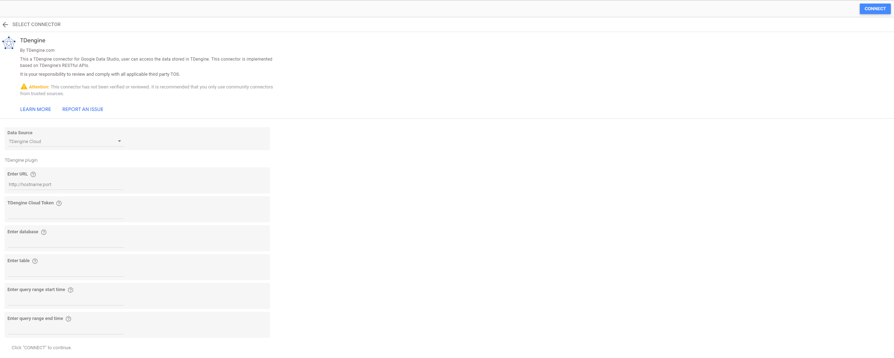

# TDengine Google Looker Studio Connector

TDengine connector for Google Looker Studio. This connector is based on TDengine's [RESTful](https://tdengine.com/docs/en/v2.0/connector#restful) APIs and can connect with either a TDengine server with taosAdapter installed or a TDengine cloud instance.
This document includes the following content:

* Prerequisite of using TDengine connector for Google Looker Studio.

* Connect configuration information.

* Relationship with Google Looker Studio [ConceptType](https://developers.google.com/datastudio/connector/reference#concepttype) and [DataType](https://developers.google.com/datastudio/connector/reference#datatype).

* A simple example.

## Prerequisite

You can install `TDengine server` with `taosAdapter` or just using `TDengine cloud`.

* [Install TDengine server](https://tdengine.com/getting-started/install), and the server must be accessible for Google Looker Studio(host is publicly-accessible).

* [Install taosAdapter](https://github.com/taosdata/taosadapter#install-taosadapter) and make sure [taosAdapter](https://github.com/taosdata/taosadapter#startstop-taosadapter) has been started successfully.

* [Use TDengine Cloud](https://uc.cloud.tdengine.com) to connect with your cloud instances with URLs and Tokens.  

## Connect Configuration Information Description

### Data Source

_**Necessary configuration**_

This is a single selection that needs to be selected first. Options include `TDengine Server` and `TDengine Cloud`. Based on the option you choose, you will see different configuration items.

### URL

_**Necessary configuration for both `TDengine Server` and `TDengine Cloud`**_

This URL is used to send http requests to TDengine through REST APIs.
For `TDengine Server`, the URL format should follow the syntax: `http://hostname:port`. In this URL, the hostname needs to be accessible on a public network. What’s more, the `port` should be opened and the TDengine REST connection's default port is 6041.
The following is a `TDengine Server` URL example:

``` bash
# For TDengine Server
http://norepeat.space:6041
```

For `TDengine Cloud`, you can get this URL from your cloud instance information page. Indeed, this URL's instance must be in active status. The following is a `TDengine Cloud` URL example.

``` bash
# For TDengine Cloud 
http://gw.us-east-1.aws.cloud.tdengine.com:80
```

### TDengine Cloud Token

_**Necessary configuration for `TDengine Cloud`**_
This token is from your TDengine cloud, which should correspond with an active instance URL.
The following is a `TDengine Cloud` token example.

``` bash
9da2fda0b141e3c85064cdcca90ea9357c9bd790
```

### username

_**Necessary configuration for `TDengine Server`**_

The username, which has the access priority of the database that you want to query. In the example, the username is `root`, and that is the default user of TDengine.

### password

_**Necessary configuration for `TDengine Server`**_

The password corresponds with the username you have entered in the previous text field. In the example, `taosdata` is the default password for TDengine's default user `root`.

### database

_**Necessary configuration for both `TDengine Cloud` and `TDengine Server`**_

The database name that contains the table(no matter if it is a normal table, a super table or a child table) is the one you want to query for data and make reports on.
In the example, we suggest we want to access a database named `test`.

### table

_**Necessary configuration for both `TDengine Cloud` and `TDengine Server`**_

The name of the table you want to connect to and query its data to make a report. In this example, we will create a report for table `meters`.

**Notice** Currently, the maximum number of retrieved records is 1000000 rows.

### Query range start date & end date

_**Optional configurations**_

There are two text fields on our [login page](https://github.com/taosdata/gds-connector/blob/master/resource/login_page.jpg). Generally, these are two date filter conditions which are used to limit the amount of retrieved data, and the date should be entered in `YYYY-MM-DD HH:MM:SS` format.
e.g.

``` bash
2022-05-12 18:24:15
```

The `start date` defines the beginning timestamp of the query result. In other words, records earlier than this `start date` will not be retrieved.

The `end time` indicates the end timestamp of the query result. Which means that records later than this `end date` will not be retrieved.
These conditions are used in SQL statement's where clause like:

``` SQL
-- select * from table_name where ts >= start_date and ts <= end_date
select * from test.demo where ts >= '2022-05-10 18:24:15' and ts<='2022-05-12 18:24:15'
```

Indeed, through these filters, you can improve the data loading speed in your report.

## Match with Google Looker Studio [ConceptType](https://developers.google.com/datastudio/connector/reference#concepttype) and [DataType](https://developers.google.com/datastudio/connector/reference#datatype)

### ConceptType

Currently, we set TDengine's TAG columns and timestamp columns as dimensions, and other columns will be set as metrics.

### DataType

TDengine's data type mapping with Google Looker Studio's field type. You can refer to the following matrix.
|TDengine's DataType    |GDS's DataType        |
|:-----------------------|:----------------------|
| BOOL                   | BOOLEAN               |
| TINYINT                | NUMBER                |
| SMALLINT               | NUMBER                |
| INT                    | NUMBER                |
| BIGINT                 | NUMBER                |
| FLOAT                  | NUMBER                |
| DOUBLE                 | NUMBER                |
| TINYINT UNSIGNED       | NUMBER                |
| SMALLINT UNSIGNED      | NUMBER                |
| INT UNSIGNED           | NUMBER                |
| BIGINT UNSIGNED        | NUMBER                |
| BINARY                 | TEXT                  |
| NCHAR                  | TEXT                  |
| JSON                   | TEXT                  |
| TIMESTAMP              | YEAR_MONTH_DAY_SECOND |

## A Simple Using Example

### Authorize Page


### Login Config Page

#### TDengine Cloud Login Config



#### TDengine Server Login Config


### Got Connection


### Example Report Template


