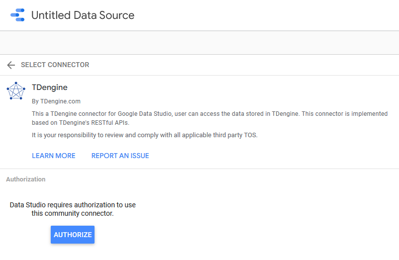
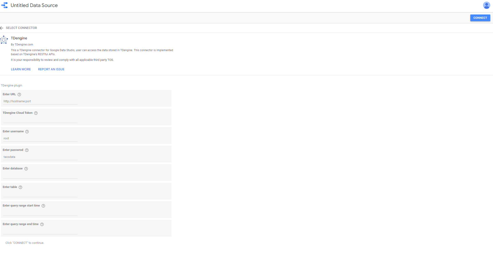
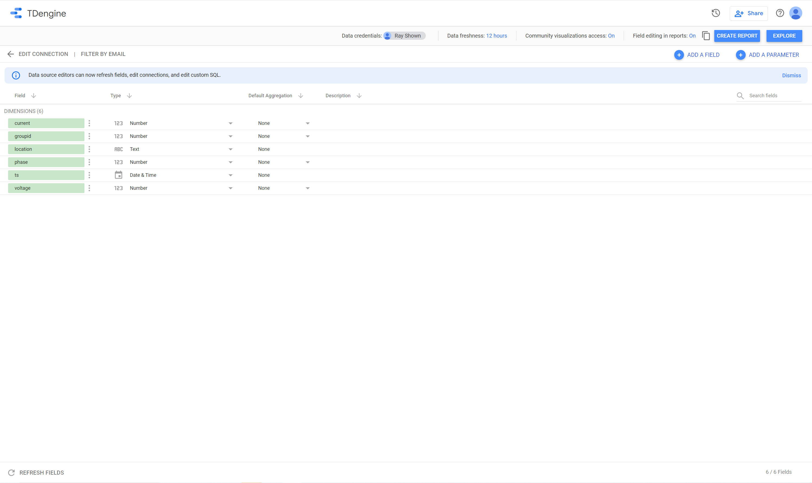
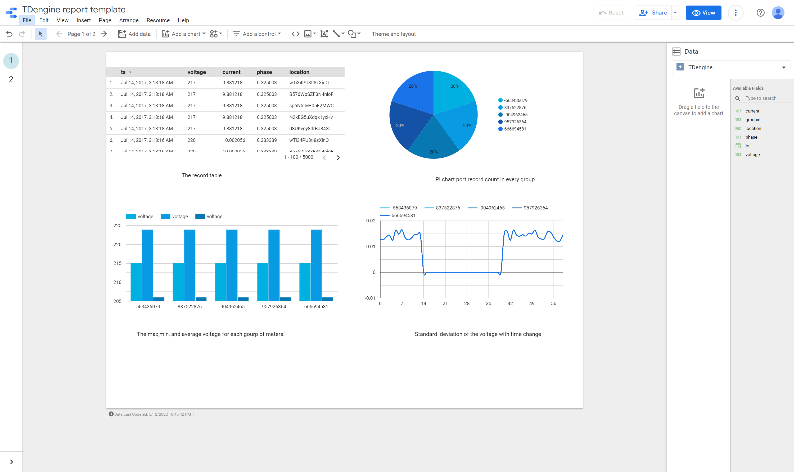

# TDengine Google Data Studio Connector

TDengine connector for Google Data Studio. This connector is based on TDengine's [RESTful](https://tdengine.com/docs/en/v2.0/connector#restful) APIs.
This document include these content:

* Prerequisite of using TDengine connector for Google Data Studio.

* Connect configuration information.

* Relationship with Google Data Studio [ConceptType](https://developers.google.com/datastudio/connector/reference#concepttype) and [DataType](https://developers.google.com/datastudio/connector/reference#datatype).

* A simple example.

## Prerequisite

* [Install TDengine server](https://tdengine.com/getting-started/install), and the server must be accessible for Google Data Studio(host is publicly-accessible).

* [Install taosAdapter](https://github.com/taosdata/taosadapter#install-taosadapter) and make sure [taosAdapter](https://github.com/taosdata/taosadapter#startstop-taosadapter) has been started successfully.
  
## Connect Configuration Information Description

### URL

_**Necessary configuration**_

This URL is used to send http requests to TDengine through REST APIs.
URL format should follow this syntax: `http://hostname:port`. In the URL the hostname needs to be accessible in a public network. What’s more, `port` should be opened and TDengine REST connection's default port is 6041. The follow is an example:

``` bash
http://norepeat.space:6041
```

### TDengine Cloud Token

_**Unnecessary configuration,only for TDengine CLoud**_
This token is from your TDengine cloud, which should be corresponding with the cloud URL.

### username

_**Unnecessary configuration,cloud be empty if use TDengine Cloud Token**_

The user name which has the access priority of the database that you want to query. In the example, the username is `root` and that is the default user of TDengine.

### password

_**Unnecessary configuration,cloud be empty if use TDengine Cloud Token**_

The password is corresponded with the username you have entered in the previous text field. In the example, `taosdata` is the default password to TDengine's default user `root`。

### database

_**Necessary configuration**_

The database name that contains the table(no matter if it is a normal table, super table or a child table) you want to query data and make reports.
In the example, we suggest we want to access a database named `test`.

### table

_**Necessary configuration**_

The name of the table you want to connect with and query its data to make a report. In the example, we will create a report for table `meters`.

**Notice** Currently the maximum number of retrieved records is 1000000 rows.

### Query range start date & end date

_**Optional configurations**_

Generally, these are two filter conditions which are used to limit the amount of retrieved data. They are two text fields in our [login page](https://github.com/taosdata/gds-connector/blob/master/resource/login_page.jpg),and the date should enter in `YYYY-MM-DD HH:MM:SS` format.
eg.

``` bash
2022-05-12 18:24:15
```

The `start date` defines the beginning timestamp of the query result. In other words, records earlier than this `start date` will not be retrieved.

The `end time` indicates the end timestamp of the query result.Which means that records later than this `end date` will not be retrieved.
These conditions are used in SQL statement's where clause like：

``` SQL
-- select * from table_name where ts >= start_date and ts <= end_date
select * from test.demo where ts >= '2022-05-10 18:24:15' and ts<='2022-05-12 18:24:15'
```

Indeed, through these filters, you can improve data loading speed in your report.

## Match with Google Data Studio [ConceptType](https://developers.google.com/datastudio/connector/reference#concepttype) and [DataType](https://developers.google.com/datastudio/connector/reference#datatype)

### ConceptType

Currently, we set TDengine's TAG columns and timestamp columns as dimension, and other columns will be set to metrics.

### DataType

TDengine's data type mapping with Google Data Studio's field's time. You can refer to the following matrix.
| TDengine's   data type | GDS's Datatype        |
|------------------------|-----------------------|
| BOOL                   | BOOLEAN               |
| TINYINT                | NUMBER                |
| SMALLINT               | NUMBER                |
| INT                    | NUMBER                |
| BIGINT                 | NUMBER                |
| FLOAT                  | NUMBER                |
| DOUBLE                 | NUMBER                |
| TINYINT UNSIGNED       | NUMBER                |
| SMALLINT UNSIGNED      | NUMBER                |
| INT UNSIGNED           | NUMBER                |
| BIGINT UNSIGNED        | NUMBER                |
| BINARY                 | TEXT                  |
| NCHAR                  | TEXT                  |
| JSON                   | TEXT                  |
| TIMESTAMP              | YEAR_MONTH_DAY_SECOND |

## A Simple Using Example

### Authorize Page



### Login Config Page



### Got Connection



### Example Report Template


